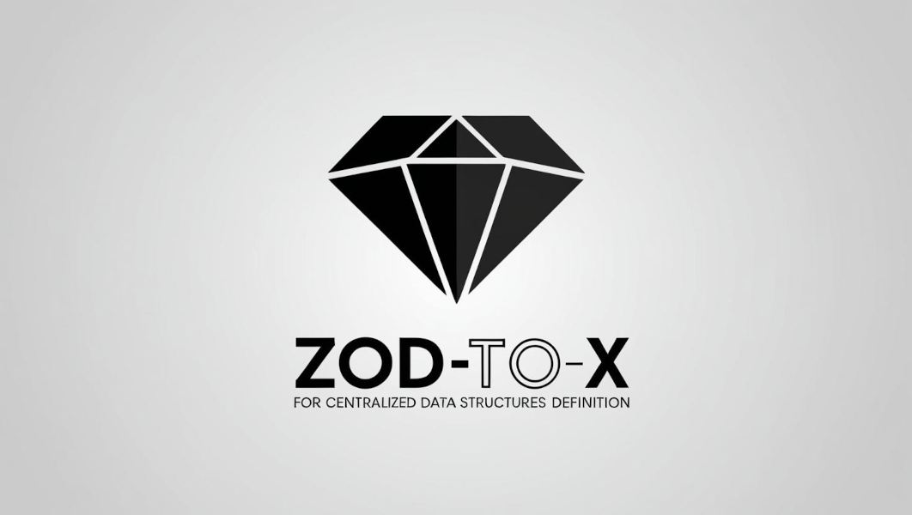

<p align="center">
  <br>
  <em style="font-size: smaller;">Image generated using Canvas AI.</em>
</p>
<p align="center">
  <a href="https://github.com/rroumenov/zod-to-x/releases" target="_blank" style="text-decoration: none;">
    <button style="padding: 6px 12px; font-size: 14px; background-color: #2ea44f; color: white; border: 1px solid rgba(27, 31, 35, 0.15); border-radius: 6px; cursor: pointer; font-family: -apple-system, BlinkMacSystemFont, 'Segoe UI', Helvetica, Arial, sans-serif, 'Apple Color Emoji', 'Segoe UI Emoji';">
      View Changelog
    </button>
  </a>
  <a href="https://playcode.io/2277071" target="_blank" style="text-decoration: none; margin-left: 10px;">
    <button style="padding: 6px 12px; font-size: 14px; background-color: #0366d6; color: white; border: 1px solid rgba(27, 31, 35, 0.15); border-radius: 6px; cursor: pointer; font-family: -apple-system, BlinkMacSystemFont, 'Segoe UI', Helvetica, Arial, sans-serif, 'Apple Color Emoji', 'Segoe UI Emoji';">
      Try it on Playcode
    </button>
  </a>
</p>


[`@zod-to-x`](https://github.com/rroumenov/zod-to-x) is a Zod-based library designed to establish a centralized methodology for defining data structures. It allows you to transpile these definitions into various programming languages in a clear and straightforward way. This tool addresses a fundamental requirement of any software: having a clear understanding of the data it handles.


## Table of contents
- [Why use `@zod-to-x`](#why-use-zod-to-x)
- [Installation](#installation)
- [Quick start](#quick-start)
- [Intersections and Unions](#intersections-and-unions)
- [Layered modeling](#layered-modeling) <sup>*(new)*</sup>
- [Supported output languages](#supported-output-languages)
- [Mapping of supported Zod Types](#mapping-of-supported-zod-types)
- [Additional utils](#additional-utils)


## Why Use [`@zod-to-x`](https://github.com/rroumenov/zod-to-x)?
Managing data consistency across multiple layers and languages is a common challenge in modern software development. [`@zod-to-x`](https://github.com/rroumenov/zod-to-x) solves this by allowing you to define your data models once and effortlessly transpile them into multiple programming languages. Here’s why it stands out:

1. **Centralized Data Definition**  
Define your data structures in one place using the powerful [`@zod`](https://github.com/colinhacks/zod) library. This eliminates redundancy, reduces inconsistencies, and simplifies maintenance across your entire codebase, all while allowing you to continue leveraging any npm package in the [`@zod`](https://github.com/colinhacks/zod) ecosystem like [`@zod-to-json-schema`](https://github.com/StefanTerdell/zod-to-json-schema)

2. **Multi-Language Compatibility**  
Generate data models for TypeScript, Protobuf V3 and C++ (with languages like Golang on the roadmap). No more manually rewriting models for different platforms.

3. **Enhanced Productivity**  
Automate the transpilation of data models to save time, reduce errors, and let your team focus on business logic instead of boilerplate code.


## Installation
### 1) Install [`@zod-to-x`](https://github.com/rroumenov/zod-to-x) and [`@zod(*)`](https://github.com/colinhacks/zod) dependency.
```bash
npm install zod-to-x zod
```
(*) [`zod@3.22.3`](https://www.npmjs.com/package/zod/v/3.22.0) version or greather is required.

### 2) Extend Zod using the `extendZod` method after the first [`@zod`](https://github.com/colinhacks/zod) import:
```ts
import { z } from "zod";
import { extendZod } from "zod-to-x";
extendZod(z);
```

This extension appends a `zod2x` method to:
- ZodEnum
- ZodNativeEnum
- ZodObject
- ZodUnion
- ZodDiscriminatedUnion
- ZodIntersection
- ZodLiteral

## Quick start
```ts
import { z } from "zod";
import { extendZod, Zod2Ast, Zod2Ts } from "zod-to-x";
extendZod(z); // The extend step can be skipped if it has already been done.

/**
 * 1) Define a data model using Zod schemas
 */
const VisitorSchema = z.object({
  id: z.string().uuid(),
  name: z.string(),
  email: z.string().email(),
  visitDate: z.date(),
  comments: z.string().optional(),
}).zod2x("Visitor"); // Add your expected output type name using the 'zod2x' method.

/**
 * 2) Build an AST node of the Zod schema
 */
const visitorNodes = new Zod2Ast().build(VisitorSchema);

/**
 * 3) Generate types in the desired language.
 *    Depending on the transpiled language, data models can be generated using classes.
 */
const tsVisitorAsInterface: string = new Zod2Ts().transpile(visitorNodes);
console.log(tsVisitorAsInterface)
// output:
// export interface Visitor {
//     id: string;
//     name: string;
//     email: string;
//     visitDate: Date;
//     comments?: string;
// }

const tsVisitorAsClass: string = new Zod2Ts({outType: "class"}).transpile(visitorNodes);
console.log(tsVisitorAsClass)
// output:
// export class Visitor {
//     id: string;
//     name: string;
//     email: string;
//     visitDate: Date;
//     comments?: string;

//     constructor(data: Visitor) {
//         this.id = data.id;
//         this.name = data.name;
//         this.email = data.email;
//         this.visitDate = data.visitdate;
//         this.comments = data.comments;
//     }
// }
```


Example of supported schemas with its outputs can be found in the `test` folder:
- [Zod Schemas](test/common)
- [Typescript outputs](test/test_zod2ts)
- [Protobuf V3 outputs](test/test_zod2proto3/)
- [C++ outputs](test/test_zod2cpp/)


## Intersections and Unions
Starting from `v1.3.0`, a best practices helper is enabled by default when handling data intersections and unions:
- Intersections and Unions can only be performed between ZodObject schemas.
- Discriminant unions shall be used instead of Unions.

These rules help ensure that each data model follows the single responsibility principle. Otherwise, an error will be thrown when building an `ASTNode`.

**NOTE**: You can disable these rules at your own risk by setting the `strict` flag to `false` when building the `ASTNode` data model. However, any unexpected behavior or issues resulting from this will not be supported.

### Expected outputs
- **For Intersections**: whenever possible, an intersection is transpiled into a struct/class that inherits from the intersected data models. Otherwise, a new struct/class is created, where attributes are the result of merging the intersected data models. Any shared key is overridden by the last matching type.
```ts
const DataA = z.object({ keyA: z.string(), keyC: z.string() }).zod2x("DataA");
const DataB = z.object({ keyB: z.string(), keyC: z.number() }).zod2x("DataB");
const Intersection = z.intersection(DataA, DataB).zod2x("Intersection");

// C++ case (with inheritance)
// struct Intersection : public DataA, public DataB {
//   // Intersection fields are inherited from base structs.
// };

// Typescript case (with attribute merging)
// class Intersection {
//   keyA: string;
//   keyB: string;
//   keyC: number; // Shared key overriden using the last type.
// };
```
- **For Unions**: whenever possible, a union is transpiled into a variant type composed of the united data models. Otherwise, a new struct/class is created, where attributes are the result of merging the intersected data models. Any common key is preserved as is (if only its requirement differs, it is changed to optional). Other keys are also set as optional.
```ts
const DataA = z.object({ keyA: z.string(), keyD: z.string() }).zod2x("DataA");
const DataB = z.object({ keyB: z.string(), keyD: z.string() }).zod2x("DataB");
const Intersection = z.intersection(DataA, DataB).zod2x("Intersection");

// C++ case (with variant type)
// using Intersection = std::variant<DataA, DataB>;

// Typescript case (with attributes merge)
// class Intersection {
//   keyA?: string; // Different keys are set as optional
//   keyB?: string;
//   keyD: number; // Shared key preserved as is.
// };
```


### Tips for discriminated unions
To enhance data modeling and the serialization/deserialization of a discriminated union type, two key steps should be considered:
- Using `ZodEnum` or `ZodNativeEnum` the define the discriminator key options.
- Using `ZodLiteral` to define the specific value of the discriminator key.

Example of discriminant definition:
```ts
// Define message types
export const MsgType = z.enum(["TypeA", "TypeB"]).zod2x("MsgType");

// Define different message structures based on the 'msgType' value.
const MessageA = z
    .object({
        key: z.string(),

        // Assign the type using the corresponding MsgType value and link it with 'zod2x'.
        msgType: z.literal(MsgType.Values.TypeA).zod2x(MsgType),  
    })
    .zod2x("MessageA");

const MessageB = z
    .object({
        otherKey: z.string(),

        // Same process as MessageA.
        msgType: z.literal(MsgType.Values.TypeB).zod2x(MsgType),
    })
    .zod2x("MessageB");

// Define the main Message type using ZodDiscriminatedUnion.
export const Message = z
    .discriminatedUnion("msgType", [MessageA, MessageB])
    .zod2x("Message");
```

Example of C++ output:
```cpp
// Discriminated union with direct serialization/deserialization
inline void from_json(const json& j, Message& x) {
    const auto& k = j.at("msgType").get<std::string>();
    if (k == "TypeA") {
        x = j.get<MessageA>();
    }
    else if (k == "TypeB") {
        x = j.get<MessageB>();
    }
    else {
        throw std::runtime_error("Failed to deserialize Message: unknown format");
    }
}


// Using a regular union or a discriminated union without the above approach:
// Fallback to try-catch for serialization/deserialization
inline void from_json(const json& j, Message& x) {
  try {
      x = j.get<MessageA>();
      return;
  } catch (const std::exception&) {
  }
  try {
      x = j.get<MessageB>();
      return;
  } catch (const std::exception&) {
      throw std::runtime_error("Failed to deserialize Message: unknown format");
  }
}
```


## Layered modeling
To improve Separation of Concerns (SoC), the Dependency Rule, and Maintainability, a new layer-based modeling approach was introduced in `v1.4.0`. This approach establishes relationships between models in separate files, which are transpiled into file imports. This feature provides a powerful tool not only for type systems with robust architectures, such as Clean, Hexagonal, or Layered, but also enforces their usage.

To achieve this, two new components are included:
- **Zod2XModel**: With layered modeling, data is defined using classes. Inheriting this abstract class provides metadata management to handle relationships and also simplifies transpilation by including a `transpile()` method that receives the target language class.
- **Layer**: A class decorator that defines class metadata, including a reference to the output file of the modeled data, a namespace under which its types are grouped, and an integer index representing the layer number. It can also be used as a decorator factory to define custom layers. Out of the box, four layers are provided: *Domain*, *Application*, *Infrastructure*, and *Presentation*.

### Usage example
1. Define a Domain model, such as a User entity:
```ts
@Domain({ namespace: "USER", file: "user.entity" })
class UserModels extends Zod2XModel {

    userRole = z.enum(["Admin", "User"]).zod2x("UserRole"); // (*)

    userEntity = z.object({
        id: z.string().uuid(),
        name: z.string().min(1),
        email: z.string().email(),
        age: z.number().int().nonnegative().optional(),
        role: this.userRole,
    }); // (*)
}

const userModels = new UserModels();
console.log(userModels.transpile(Transpilers.Zod2Ts));
// Output:
// export enum UserRole {
//     Admin = "Admin",
//     User = "User",
// }

// export interface UserEntity {
//     id: string;
//     name: string;
//     email: string;
//     age?: number;
//     role: UserRole;
// }

// export interface UserModels {
//     userRole: UserRole;
//     userEntity: UserEntity;
// }

```
**(*)** Thanks to the Layer decorator, the use of `zod2x` for type naming can now be omitted, simplifying and clarifying the process of model definition. By default, it will take the property name and apply a Pascal case convention (example: *myProperty* -> *MyProperty*).  
You can still use it if you want to enforce a different type name.

2. Define an Application model, such as a User DTO:
```ts
// Create DTOs using previously defined user models.
@Application({ namespace: "USER_DTOS", file: "user.dtos" })
class UserDtos extends Zod2XModel {

    createUserUseCaseDto = userModels.userEntity.omit({ id: true });  // (*)

    createUserUseCaseResultDto = userModels.userEntity
        .omit({ role: true })
        .extend({
            createdAt: z.date(),
            updatedAt: z.date(),
        }); // (*)
}

const userDtos = new UserDtos();
console.log(userDtos.transpile(Transpilers.Zod2Ts))
// Output:
// import * as USER from "./user.entity";    <--- Reusing models from other layers.

// export interface CreateUserUseCaseDto {
//     name: string;
//     email: string;
//     age?: number;
//     role: USER.UserRole;
// }

// export interface CreateUserUseCaseResultDto {
//     id: string;
//     name: string;
//     email: string;
//     age?: number;
//     createdAt: Date;
//     updatedAt: Date;
// }

// export interface UserDtos {
//     createUserUseCaseDto: CreateUserUseCaseDto;
//     createUserUseCaseResultDto: CreateUserUseCaseResultDto;
// }

```
**(*)** Any modification of an existing model (in this case, `userEntity`) will lose the relation with that model, but not its children. In the case of the `CreateUserUseCaseDto` type, the `role` field will remain linked to the existing one in the `user.entity` file.


## Supported output languages
Common options:
- **header**: Text to add as a comment at the beginning of the output.
- **indent**: Number of spaces to use for indentation in the generated code. Defaults to 4 if not specified.
- **includeComments**: Determines whether to include comments in the transpiled code. Defaults to `true`.
- **skipDiscriminatorNodes**: prevents the inclusion of `ZodEnum` or `ZodNativeEnum` schemas that are used solely as discriminator keys in a `ZodDiscriminatedUnion`. Defaults to `false`.

### 0) ASTNode
- Options:
  - **strict**: When true, it will throw an error if a bad data modeling practice is detected. Default is `true`.

### 1) Typescript  
- Options:
  - **outType**: Output transpilation using Typescript interfaces or Classes. Defaults to `interface`.

### 2) Protobuf V3
- Options:
  - **packageName**: Name of the protobuf file package.
  - **useCamelCase**: Protobuf follows the snake_case convention for field names, but camelCase can also be used. Defaults to `false`.

- Limitations:
  - `ZodTuple` is supported only for items of the same type.


### 3) C++
`Nlohmann` dependency is used for data serialization/deserialization. For *C++11*, `Boost` dependency is used. For *C++17* or newer, standard libraries are used.
- Options:
  - **includeNulls**: When serializing, include all values even if `null`. Defaults to `false`.
  - **namespace**: Name of the namespace containing the output code.
  - **outType**: Output transpilation using C++ Structs or Classes. Defaults to `struct`.
  - **skipSerialize**: Remove Nlohmann JSON serialization/deserialization. Defaults to `false`.


## Mapping of supported Zod Types

| Zod Type              | TypeScript                  | Protobuf                                      | C++                                           |
|-----------------------|-----------------------------|-----------------------------------------------|-----------------------------------------------|
| `z.string()`          | `string`                    | `string`                                      | `std::string`
| `z.number()`          | `number`                    | `double`, `uint32`, `uint64`, `ìnt32`, `int64`| `double`, `uint32_t`, `uint64_t`, `ìnt32_t`, `int64_t`
| `z.bigint()`          | `number`                    | `int64`, `uint64`                             | `int64_t`, `uint64_t`
| `z.boolean()`         | `boolean`                   | `bool`                                        | `bool`
| `z.date()`            | `Date`                      | `google.protobuf.Timestamp`                   | Not supported
| `z.literal()`         | Literal value (`'value'`)   | As number or string                           | As string
| `z.enum()`            | `enum`                      | `enum`                                        | `enum class T: int`
| `z.nativeEnum()`      | Native `enum`               | `enum`                                        | `enum class T: int`
| `z.array()`           | `T[]`                       | `repeated` field                              | `std::vector<T>`
| `z.set()`             | `Set<T>`                    | `repeated` field                              | `std::set<T>`
| `z.tuple()`           | `[T1, T2, T3]`              | `repeated` field                              | `std::tuple<T1, T2, T3>`
| `z.object()`          | `interface` or `class`      | `message`                                     | `struct` or `class`
| `z.record()`          | `Record<string, T>`         | `map<string, K>`                              | `std::unordered_map<T>`
| `z.map()`             | `Map<string, T>`            | `map<string, K>`                              | `std::unordered_map<T>`
| `z.union()` <sup>(2)</sup> | `T1 \| T2` or `type`   | `oneof`                                       | `std::variant<T, K>` (`boost::variant<T, K>` for C++11)
| `z.discriminatedUnion()`| `T1 \| T2` or `type`      | `oneof`                                       | `std::variant<T, K>` (`boost::variant<T, K>` for C++11)
| `z.intersection()` <sup>(1)</sup> | `T1 & T2` or `type`         | Not supported                     | `struct` or `class` with `inheritance`
| `z.any()`             | `any`                       | `google.protobuf.Any`                         | `nlohmann::json`
| `z.optional()`        | `T \| undefined`            | Not supported                                 | `std::optional<T>` (`boost::optional<T>` for C++11)
| `z.nullable()`        | `T \| null`                 | Not supported                                 | `std::optional<T>` (`boost::optional<T>` for C++11)

<sup>(1)</sup> Consider to use Zod's merge instead of ZodIntersection when possible.  
<sup>(2)</sup> Consider to use ZodDiscriminatedUnion when possible. In languages like C++, deserialization is O(1) against the O(n) of the ZodUnion.

## Additional utils
- `zod2JsonSchemaDefinitions`  
In case of use of libraries like [`@zod-to-json-schema`](https://github.com/StefanTerdell/zod-to-json-schema), the provided zod extension can also be used
as a JSON Schema definitions mapper:
```ts
import { z } from 'zod';
import { extendZod, zod2JsonSchemaDefinitions } from 'zod-to-x';
import { zodToJsonSchema } from 'zod-to-json-schema';

extendZod(z);

const Address = z.object({
    street: z.string(),
    city: z.string(),
    zipCode: z.string().nullable(),
}).zod2x("UserAddress");

const UserRole = z.union([
    z.literal('admin'),
    z.literal('editor'),
    z.literal('viewer')
]).zod2x("UserRole");

const StatusEnum = z.enum([
    'active',
    'inactive',
    'pending']
)
.describe("This is a UserStatus enumerate description.")
.zod2x("UserStatus");

export const UserModel = z.object({
    address: Address,
    roles: z.array(UserRole),
    status: StatusEnum,
    friends: z.lazy((): ZodType => UserModel.array().optional().nullable()),
  // [... more attributes]
})
.describe("This is a UserModel interface description.")
.zod2x("UserModel");

const userDefinitions = zod2JsonSchemaDefinitions(UserModel);
const userJsonSchema = zodToJsonSchema(UserModel, {definitions: userDefinitions});
console.log(userJsonSchema);
// output:
// {
//   "$ref": "#/definitions/UserModel",
//   "definitions": {
//     "UserAddress": {
//       "type": "object",
//       "properties": {
//         "street": {
//           "type": "string"
//         },
//         "city": {
//           "type": "string"
//         },
//         "zipCode": {
//           "type": [
//             "string",
//             "null"
//           ]
//         }
//       },
//       "required": [
//         "street",
//         "city",
//         "zipCode"
//       ],
//       "additionalProperties": false
//     },
//     "UserRole": {
//       "type": "string",
//       "enum": [
//         "admin",
//         "editor",
//         "viewer"
//       ]
//     },
//     "UserStatus": {
//       "type": "string",
//       "enum": [
//         "active",
//         "inactive",
//         "pending"
//       ],
//       "description": "This is a UserStatus enumerate description."
//     },
//     "UserModel": {
//       "type": "object",
//       "properties": {
//         "address": {
//           "$ref": "#/definitions/UserAddress"
//         },
//         "roles": {
//           "type": "array",
//           "items": {
//             "$ref": "#/definitions/UserRole"
//           }
//         },
//         "status": {
//           "$ref": "#/definitions/UserStatus"
//         },
//         "friends": {
//           "anyOf": [
//             {
//               "anyOf": [
//                 {
//                   "not": {}
//                 },
//                 {
//                   "type": "array",
//                   "items": {
//                     "$ref": "#/definitions/UserModel"
//                   },
//                   "description": "This is a UserModel interface description."
//                 }
//               ],
//               "description": "This is a UserModel interface description."
//             },
//             {
//               "type": "null"
//             }
//           ],
//           "description": "This is a UserModel interface description."
//         },
//       },
//       "required": [
//         "address",
//         "roles",
//         "status",
//       ],
//       "additionalProperties": false,
//       "description": "This is a UserModel interface description."
//     }
//   },
//   "$schema": "http://json-schema.org/draft-07/schema#"
// }
```